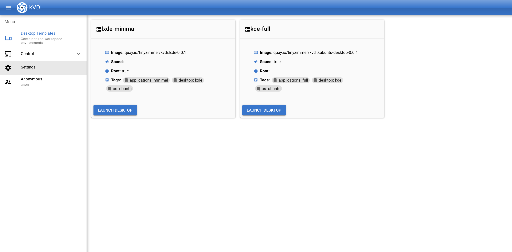
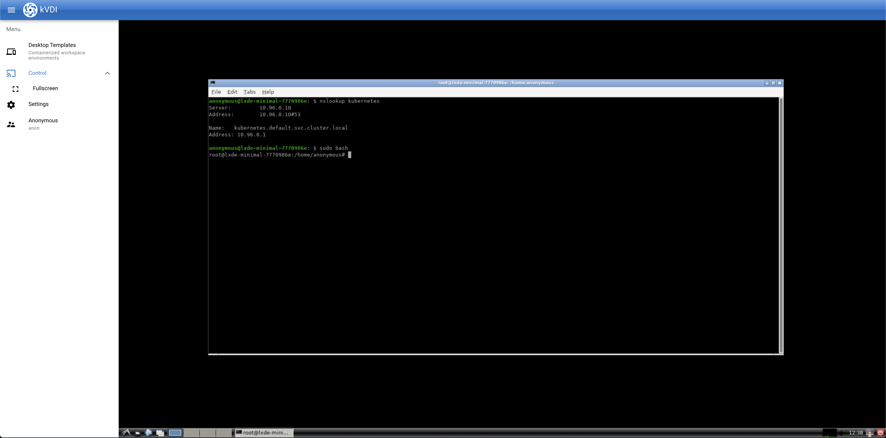
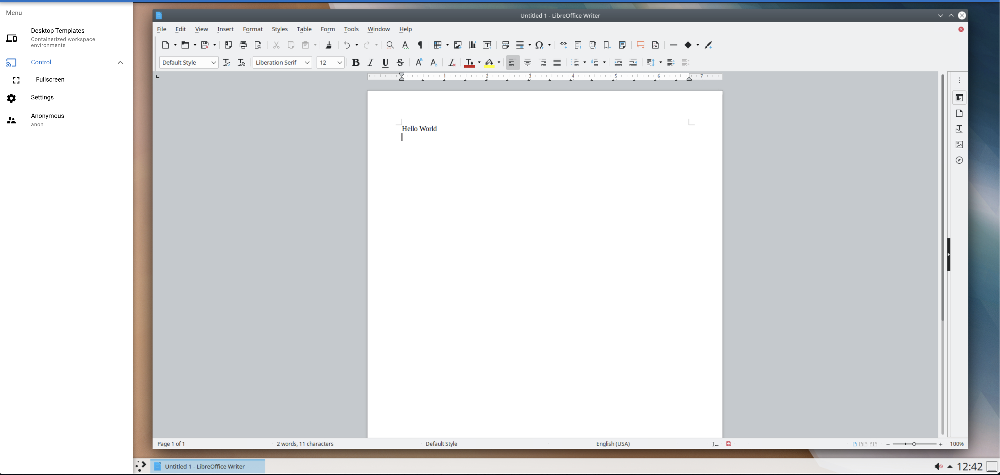

# kVDI

A Kubernetes-native Virtual Desktop Infrastructure.


[](https://pkg.go.dev/github.com/tinyzimmer/kvdi)

**This is a fast-changing work in progress and not recommended for production usage**

 - [API Reference](doc/crds.md)
 - [Building Desktop Images](build/desktops/README.md)
 - [Security](#security)
 - [Screenshots](#screenshots)

I'll write up better CONTRIBUTING docs soon, but I am getting to the point where it'd be cool to have some collaboration.
If you are wanting this to become a real thing (or are just interested in trying it out), and you run into any issues, feel free to open an issue here and I can try to help out.

## Features

  - Containerized user desktops running on Kubernetes with no virtualization required (`libvirt` options may come in the future).

    - All traffic between the end user and the "desktop" is encrypted.


  - Support for persistent user-data

  - Customizable RBAC system for managing user access

    - For example, desktops can be launched in specific namespaces, and users can be limited to specific templates and namespaces.


  - MFA Support

  - Configurable backend for internal secrets. Currently `vault` or Kubernetes Secrets

  - Use built-in local authentication, LDAP, or OpenID.

      - For now see the API docs, the [example `helm` values](deploy/examples/example-ldap-helm-values.yaml), and the example [`VDIRole`](hack/glauth-role.yaml). There are corresponding examples for the `oidc` auth as well.

## Requirements

For building and running locally you will need:

  - `go >= 1.14`
  - `docker`

## Installing

For more complete installation instructions see the `helm` chart docs [here](deploy/charts/kvdi/README.md).

The [API Reference](doc/crds.md) can also be used for details on `kVDI` app-level configurations.

```bash
# Add the kvdi repo
helm repo add tinyzimmer https://tinyzimmer.github.io/kvdi/deploy/charts
helm repo update  # sync your repositories

# Install kVDI
helm install kvdi tinyzimmer/kvdi
```

It will take a minute or two for all the parts to start running after the install command.
Once the app is launched, you can retrieve the admin password from `kvdi-admin-secret` in your cluster (if you are using `ldap` auth, log in with a user in one of the `adminGroups`).


To access the app interface either do a `port-forward` (`make forward-app` is another helper for that when developing locally with `kind`), or go to the "LoadBalancer" IP of the service.

By default there are no desktop templates configured. If you'd like, you can apply the ones in `deploy/examples/example-desktop-templates.yaml` to get started quickly.

## Building and Running Locally

The `Makefiles` contain helpers for testing the full solution locally using `kind`. Run `make help` to see all the available options.

_If you choose to pull the images from the registry instead of building and loading first - you probably want to set `VERSION=latest` (or a previous version) in your environment also.
The `Makefile` is usually pointed at the next version to be released and published images may not exist yet_.

```bash
# Builds all the docker images (optional, they are also available in the quay repo)
$> make build-all
# Spin up a kind cluster and load cert-manager and metallb into it
$> make full-test-cluster
# Load all the docker images into the kind cluster (optional for same reason as build)
$> make load-all
# Deploy the manager, kvdi, and setup the example templates
$> make deploy example-vdi-templates
# To test using custom helm values
$> HELM_ARGS="-f my_values.yaml" make deploy
```

After the manager has started the `app` instance, get the IP of its service with `kubectl get svc` to access the frontend, or you can run `make-forward-app` to start a local port-forward.

If not using anonymous auth, look for `kvdi-admin-secret` to retrieve the `admin` password.

## Security

All traffic between processes is encrypted with mTLS.
The UI for the "desktop" containers is placed behind a VNC server listening on a UNIX socket and a sidecar to the container will proxy validated websocket connections to it.


User authentication is provided by "providers". Currently there is only one `local-auth` implementation meant for development and testing.
It keeps a `passwd` like file in a Kubernetes secret where it stores users, password hashes, and role mappings.

RBAC is provided by a `VDIRole` CRD that behaves similar to a Kubernetes `ClusterRole`.
These roles can restrict users to namespaces, desktop templates, and user/role management.
It should not be possible for a user to make an API request that grants them more privileges than they already have.

## Screenshots

The UI is super basic but here are some shots of what I have so far.

There is actually more since I took these photos. Primarily user/role management.






