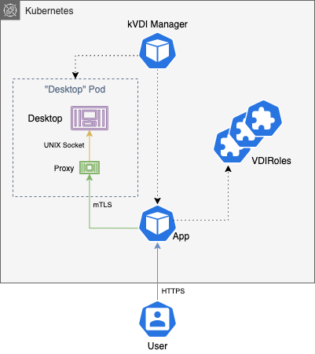

# kVDI

A Kubernetes-native Virtual Desktop Infrastructure.

_Except as I've continued to work on this, I've noticed this is really just a free and open-source VDI solution based on docker containers. Kubernetes just makes it easier to implement :smile:._


[](https://pkg.go.dev/github.com/tinyzimmer/kvdi)

**This is a fast-changing work in progress and not recommended for production usage**

 - [API Reference](doc/crds.md)
 - [Installing](#Installing)
   - [Standalone](#Install-standalone)
   - [Kubernetes](#Install-to-a-pre-existing-cluster)
   - [Standalone on EC2 with Terraform](#Install-to-an-AWS-EC2-Instance)
 - [Building Desktop Images](build/desktops/README.md)
 - [Security](#security)
 - [Screenshots/Video](doc/screenshots.md)

If you are interested in helping out or just simply launching a design discussion, feel free to send PRs and/or issues. 
I wrote up a [`CONTRIBUTING`](CONTRIBUTING.md) doc just outlining some of the stuff I have in mind that would need to be acomplished for this to be considered "stable". 

## Features

  - Containerized user desktops running on Kubernetes with no virtualization required (`libvirt` options may come in the future).

    - All traffic between the end user and the "desktop" is encrypted.


  - Support for persistent user-data

  - Customizable RBAC system for managing user access

    - For example, desktops can be launched in specific namespaces, and users can be limited to specific templates and namespaces.


  - MFA Support

  - Configurable backend for internal secrets. Currently `vault` or Kubernetes Secrets

  - Use built-in local authentication, LDAP, or OpenID.

      - For now see the API docs, the [example `helm` values](deploy/examples/example-ldap-helm-values.yaml), and the example [`VDIRole`](hack/glauth-role.yaml). There are corresponding examples for the `oidc` auth as well.

  - App metrics to either scrape externally or view in the UI. More details in the `helm` doc.

### TODO

  - "App Profiles" - I have a POC implementation on `main` but it is still pretty buggy
  - Harden images more
  - UI needs serious makeover
  - More testing and docs

## Requirements

For building and running locally you will need:

  - `go >= 1.14`
  - `docker`

## Installing

### Install standalone

If you don't have access to a Kubernetes cluster, or you just want to try `kVDI` out on a VM real quick, there is a script in this repository for setting up kVDI using `k3s`.
It requires the instance running the script to have `docker` and the `dialog` package installed.

_If you have an existing `k3s` installation, the ingress may not work since this script assumes `kVDI` will be the only LoadBalancer installed._

```bash
# Download the script from this repository.
curl -JLO https://raw.githubusercontent.com/tinyzimmer/kvdi/main/deploy/architect/kvdi-architect.sh
# Run the script. You will be prompted via dialogs to make configuration changes.
bash kvdi-architect.sh   # Use --help to see all available options.
```

_NOTE: This script is fairly new and still has some bugs_

### Install to a pre-existing cluster

For more complete installation instructions see the `helm` chart docs [here](deploy/charts/kvdi/README.md) for available configuration options.

The [API Reference](doc/crds.md) can also be used for details on `kVDI` app-level configurations.

```bash
helm repo add tinyzimmer https://tinyzimmer.github.io/kvdi/deploy/charts  # Add the kvdi repo
helm repo update                                                          # Sync your repositories

# Install kVDI
helm install kvdi tinyzimmer/kvdi
```

It will take a minute or two for all the parts to start running after the install command.
Once the app is launched, you can retrieve the admin password from `kvdi-admin-secret` in your cluster (if you are using `ldap` auth, log in with a user in one of the `adminGroups`).

To access the app interface either do a `port-forward` (`make forward-app` is another helper for that when developing locally with `kind`), or go to the "LoadBalancer" IP of the service.

By default there are no desktop templates configured. If you'd like, you can apply the ones in `deploy/examples/example-desktop-templates.yaml` to get started quickly.

### Install to an AWS EC2 Instance

I am toying with the idea of launching a demo site, and I've included the terraform code for it in this repository. It is located in [`deploy/terraform`](deploy/terraform).

There is a single required variable of `ext_ip`. Set this to your public IP to be able to access SSH and the web port. See `deploy/terraform/variables.tf` for other configuration options.

## Building and Running Locally

The `Makefiles` contain helpers for testing the full solution locally using `kind`. Run `make help` to see all the available options.

_If you choose to pull the images from the registry instead of building and loading first - you probably want to set `VERSION=latest` (or a previous version) in your environment also.
The `Makefile` is usually pointed at the next version to be released and published images may not exist yet_.

```bash
# Builds all the docker images (optional, they are also available in the quay repo)
$> make build-all
# Spin up a kind cluster for local testing
$> make test-cluster
# Load all the docker images into the kind cluster (optional for same reason as build)
$> make load-all
# Deploy the manager, kvdi, and setup the example templates
$> make deploy example-vdi-templates
# To test using custom helm values
$> HELM_ARGS="-f my_values.yaml" make deploy
```

After the manager has started the `app` instance, get the IP of its service with `kubectl get svc` to access the frontend, or you can run `make-forward-app` to start a local port-forward.

If not using anonymous auth, look for `kvdi-admin-secret` to retrieve the `admin` password.

## Security

All traffic between processes is encrypted with mTLS.
The UI for the "desktop" containers is placed behind a VNC server listening on a UNIX socket and a sidecar to the container will proxy validated websocket connections to it.



User authentication is provided by "providers". There are currently three implementations:

 * `local-auth` : A `passwd` like file is kept in the Secrets backend (k8s or vault) mapping users to roles and password hashes. This is primarily meant for development, but you could secure your environment in a way to make it viable for a small number of users.

 * `ldap-auth` : An LDAP/AD server is used for autenticating users. VDIRoles can be tied to 
 security groups in LDAP via annotations. When a user is authenticated, their groups are queried to see if they are bound to any VDIRoles.

 * `oidc-auth` : An OpenID or OAuth provider is used for authenticating users. If using an Oauth provider, it must support the `openid` scope. When a user is authenticated, a configurable `groups` claim is requested from the provider that can be mapped to VDIRoles similarly to `ldap-auth`. If the provider does not support a `groups` claim, you can configure `kVDI` to allow all authenticated users.

 All three authentication methods also support MFA.

